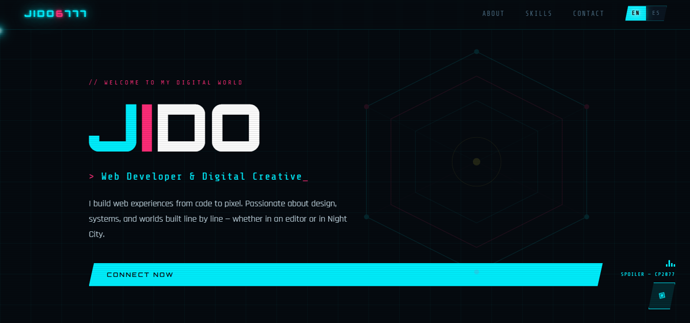
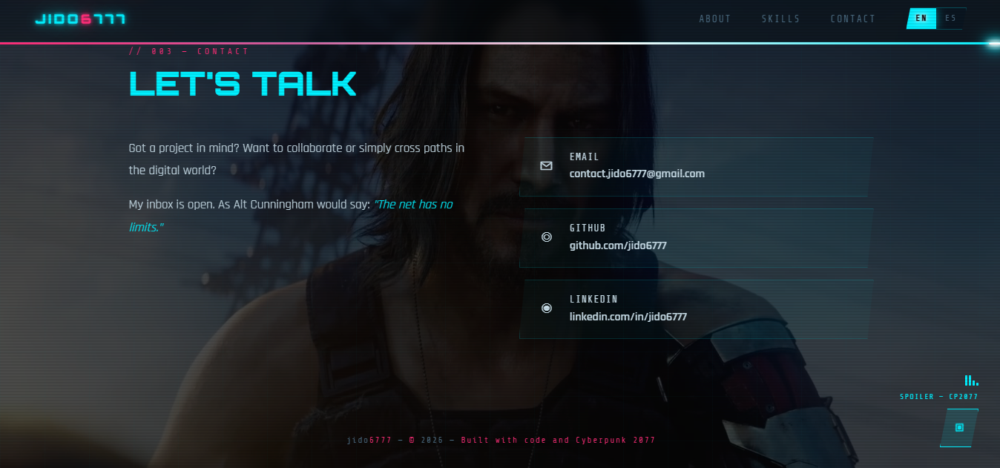

# JIDO — Web Developer Portfolio

> // Built line by line, pixel by pixel.

**Live site → [jido6777.github.io/website](https://jido6777.github.io/website/)**

---





---

## About

Personal portfolio built from scratch with a cyberpunk aesthetic — dark interfaces, neon glows, glitch effects, and a Night City atmosphere. Every detail was intentional, from the scanline overlay to Silverhand watching you decide whether to reach out.

---

## Features

- **Glitch animations** — on the logo, language switch, and music button
- **Background music** — Spoiler from Cyberpunk 2077, toggle on/off
- **Scroll progress bar** — cyan/magenta gradient that fills as you scroll
- **Video background** — plays once when you reach the contact section, pauses on the last frame
- **Bilingual** — EN / ES, auto-detected from browser language
- **Scroll reveal** — sections and skill bars animate into view
- **Fully responsive** — works on desktop and mobile

---

## Stack

```
HTML · CSS · JavaScript
No frameworks. No dependencies. Just code.
```

---

## Structure

```
website/
├── index.html
└── assets/
    ├── favicon.svg
    ├── music.mp3
    └── video.mp4
```

---

## Credits

Music and visual inspiration from **Cyberpunk 2077** by CD Projekt Red.  
All rights to their respective owners.

---

<p align="center">
  jido6777 · 2026
</p>
